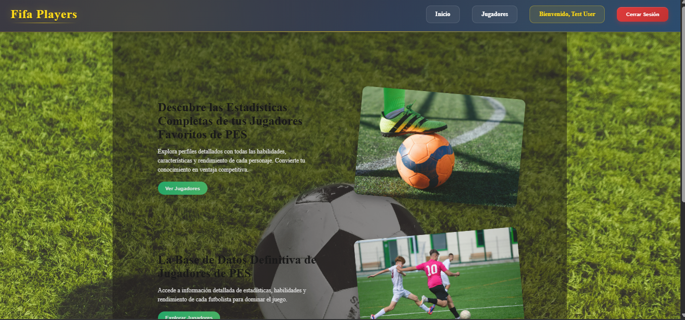
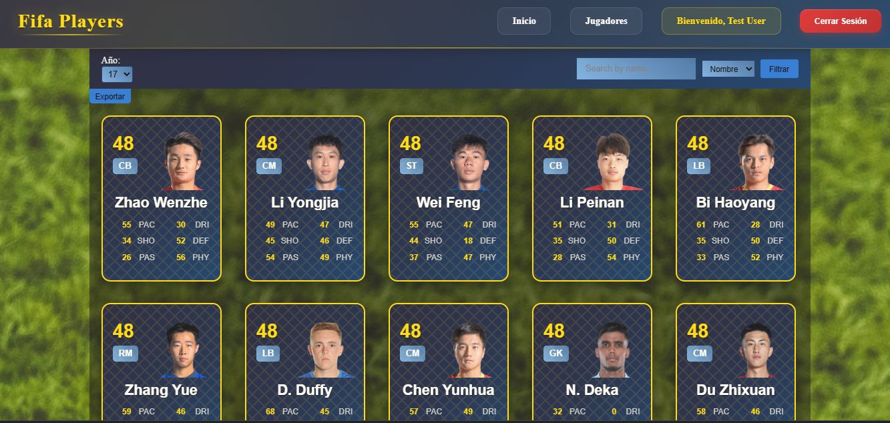
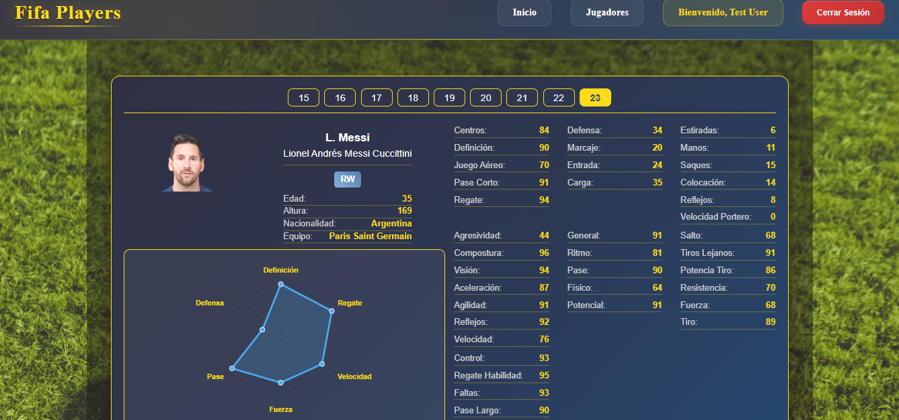

# 🎮 FIFA Players Hub - Proyecto Web

**Autor:** [Fernando Orellana]  
**Curso:** [XAcademy]  
**Entrega:** Fase 1

---

## 📖 Descripción del Proyecto

FIFA Players Hub es una aplicación web moderna que permite explorar y analizar información detallada sobre jugadores de FIFA. La plataforma incluye:

- 📊 **Visualización de datos** con gráficos interactivos
- 🔍 **Búsqueda y filtrado** avanzado de jugadores
- 📱 **Interfaz responsive** y user-friendly
- 🔐 **Sistema de autenticación** seguro
- 📈 **Análisis estadístico** de jugadores

---

## 🚀 Instalación y Configuración

### Prerrequisitos
- Node.js (v16 o superior)
- Angular CLI
- MySQL
- Postman (para testing de APIs)

### Pasos para instalación local

1. **Clonar el repositorio**
   ```bash
   git clone git@github.com:FernandoAriel80/info_fifa_players.git

   cd info_fifa_players
   ```

2. **Configurar variables de entorno**
   ```bash
   # Copiar el archivo de ejemplo
   cp .env.example .env
   
   # Editar el archivo .env con tus configuraciones
   nano .env
   ```

3. **Configurar la base de datos**
  no pude adjuntar el .sql

4. **Instalar dependencias**
   ```bash
   # Backend
   npm install
   
   # Frontend
   cd frontend
   npm install
   ```

5. **Ejecutar la aplicación**
   ```bash
   # Terminal 1 - Backend
   npm run dev
   
   # Terminal 2 - Frontend
   ng serve
   ```

6. **Acceder a la aplicación**
   - Frontend: `http://localhost:4200`
   - Backend: `http://localhost:3000`

---

## 🗂️ Estructura del Proyecto

```
fifa-players-hub/
├── backend/
│   ├── controllers/
│   ├── repositories/
│   ├── usecases/
│   ├── middleware/
│   └── routes/
├── frontend/
│   ├── src/
│   │   ├── app/
│   │   │   ├── auth/
│   │   │   ├── player/
│   │   │   └── shared/
│   │   └── assets/
└── database/
    └── script.sql
```

---

## 🌐 Endpoints del Backend

### 🔐 Autenticación
| Método | Endpoint | Descripción | Body Example |
|--------|----------|-------------|--------------|
| `POST` | `/api/auth/login` | Iniciar sesión | `{"email": "user@example.com", "password": "password"}` |
| `POST` | `/api/auth/refresh-token` | Renovar token | `{"refreshToken": "token"}` |
| `POST` | `/api/auth/register` | Registrar usuario | `{"name": "John", "email": "john@example.com", "password": "pass"}` |

### 👥 Jugadores
| Método | Endpoint | Descripción | Query Parameters |
|--------|----------|-------------|------------------|
| `GET` | `/api/players` | Obtener todos los jugadores | - |
| `GET` | `/api/players/pagination` | Jugadores paginados | `page=1&limit=20` |
| `GET` | `/api/players/players-name` | Buscar por nombre | `name=messi` |

### 📊 Datos Maestros
| Método | Endpoint | Descripción |
|--------|----------|-------------|
| `GET` | `/api/positions` | Listar todas las posiciones |
| `GET` | `/api/nationalities` | Listar nacionalidades |
| `GET` | `/api/leagues` | Listar ligas |
| `GET` | `/api/clubs` | Listar clubes |

### 📁 Archivos CSV
| Método | Endpoint | Descripción | Body Type |
|--------|----------|-------------|-----------|
| `POST` | `/api/csv/upload` | Subir archivo CSV | `multipart/form-data` |
| `GET` | `/api/csv/export` | Exportar jugadores a CSV | - |

Funcionalidad desactivada, tarda 8 horas en cargar todo el .csv 
---

## 🛠️ Testing en Postman

### Configuración inicial
1. **Crear nueva Collection**: "FIFA Players Hub"
2. **Variables de entorno**:
   - `baseUrl`: `http://localhost:3000/api`
   - `token`: (se actualizará automáticamente)

### Flujo de testing recomendado:

1. **Registro de usuario**
   ```
   POST: {{baseUrl}}/auth/register
   Body (raw JSON):
   {
     "name": "Test User",
     "email": "test@example.com",
     "password": "password123"
   }
   ```

2. **Login y guardar token**
   ```
   POST: {{baseUrl}}/auth/login
   Body (raw JSON):
   {
     "email": "test@example.com",
     "password": "password123"
   }
   
   // En Tests tab:
   pm.environment.set("token", pm.response.json().data.accessToken);
   ```

3. **Obtener jugadores (protegido)**
   ```
   GET: {{baseUrl}}/players/pagination?page=1&limit=10
   Headers: 
   Authorization: Bearer {{token}}
   ```

4. **Buscar jugador por nombre**
   ```
   GET: {{baseUrl}}/players/players-name?name=messi
   Headers: 
   Authorization: Bearer {{token}}
   ```

---

## 📊 Características del Frontend

### Módulos Principales
- **`PlayerModule`**: Gestión y visualización de jugadores
- **`AuthModule`**: Autenticación y registro
- **`SharedModule`**: Componentes y servicios reutilizables

### Rutas Protegidas
- `/players` - Requiere autenticación (`AuthGuard`)
- `/players/player/:name/:id` - Detalle de jugador protegido

### Rutas Públicas
- `/` - Página de inicio
- `/auth/login` - Login de usuarios
- `/auth/register` - Registro de nuevos usuarios

---

## 🎨 Capturas de la Aplicación

![FIFA Players Hub Screenshot]!
*Interfaz principal mostrando lista de jugadores y gráficos*
---

---

---

## 🔧 Tecnologías Utilizadas

### Backend
- **Node.js** + **Express.js**
- **MySQL** con relaciones avanzadas
- **JWT** para autenticación
- **Multer** para manejo de archivos CSV
- **Validaciones** personalizadas

### Frontend
- **Angular** Framework
- **TypeScript**
- **RxJS** para manejo de estado
- **Chart.js** para gráficos
- **Guards** para protección de rutas

---

## 📈 Próximas Características

- [ ] ⭐ Sistema de favoritos
- [ ] 📊 Comparación entre jugadores
- [ ] 🔔 Notificaciones en tiempo real
- [ ] 📱 Aplicación móvil
- [ ] 🌐 Internacionalización

---

## 🤝 Contribución

Si deseas contribuir al proyecto:

1. Fork el proyecto
2. Crea una rama feature (`git checkout -b feature/AmazingFeature`)
3. Commit tus cambios (`git commit -m 'Add some AmazingFeature'`)
4. Push a la rama (`git push origin feature/AmazingFeature`)
5. Abre un Pull Request

---

<div align="center">

**✨ Desarrollado con pasión por el fútbol y la tecnología ✨**

</div>